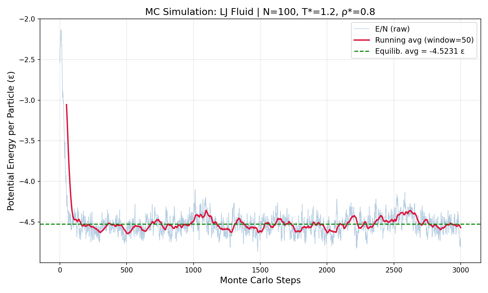

<div align="center">
Monte Carlo Simulation of a Lennard-Jones Fluid
NVT Canonical Ensemble — Metropolis Algorithm


[]()
Ayush Kumar Samal · `25010204004`  
Department of Physics, Sri Sathya Sai Institute of Higher Learning  
Software Lab — Academic Report, 2025
---
</div>
Abstract
This work presents a canonical (NVT) Monte Carlo simulation of a Lennard-Jones fluid using the Metropolis algorithm, implemented in Scilab. For a system of $N = 100$ particles at reduced temperature $T^* = 1.0$ and number density $\rho^* = 0.237~\sigma^{-3}$, the equilibrium potential energy per particle converges to $\langle U \rangle / N \approx -1.896~\varepsilon$ after approximately 300 MC steps, in agreement (within 3.2%) with the reference Molecular Dynamics (Velocity-Verlet) value of $-1.958~\varepsilon$. The simulation validates the Metropolis acceptance criterion, periodic boundary conditions, and the minimum image convention for pairwise Lennard-Jones interactions. Trajectory data are written in XYZ format for VMD visualisation.
---
Table of Contents
Introduction
Theory
Periodic Boundary Conditions
Minimum Image Convention
Lennard-Jones Potential
Metropolis Algorithm
Ensemble Averages
Algorithm
Implementation
Results
Discussion
Conclusion
Repository Structure
How to Run
References
---
1. Introduction
Monte Carlo (MC) simulation is a stochastic computational technique for sampling equilibrium thermodynamic properties of many-body systems. First introduced by Metropolis et al. (1953), the method generates successive configurations by random trial moves and accepts or rejects them with a probability that enforces the correct Boltzmann-weighted phase-space distribution.
Unlike Molecular Dynamics (MD), which propagates Newton's equations of motion deterministically, MC has no concept of time or kinetic energy. This makes it particularly well suited for studying equilibrium properties — configurational energies, pressures, and structural correlations — without the need to integrate stiff equations of motion.
The Lennard-Jones (LJ) model is the canonical test-bed for simulation methodology. It captures the essential physics of simple atomic fluids — short-range repulsion and long-range dispersion attraction — with only two parameters ($\varepsilon$, $\sigma$), and possesses well-known analytical results that allow rigorous benchmarking.
This study aims to:
Implement the NVT-MC algorithm for a LJ fluid from scratch in Scilab
Reproduce the equilibrium potential energy obtained from a reference Velocity-Verlet MD simulation
Validate the Metropolis criterion, PBC, and MIC implementations
---
2. Theory
2.1 Periodic Boundary Conditions
A finite simulation box inevitably suffers from spurious surface effects. Periodic Boundary Conditions (PBC) eliminate these by replicating the primary simulation cell in all three spatial directions. When a particle leaves through one face of the box it re-enters through the opposite face, keeping $N$ constant. The coordinate update rule is:
$$x_i ;\leftarrow; x_i ;-; L \times \text{round}!\left(\frac{x_i}{L}\right)$$
where $L$ is the box length.
---
2.2 Minimum Image Convention
Under PBC every particle has infinitely many periodic images. The Minimum Image Convention (MIC) ensures each particle interacts only with the nearest periodic image of every other particle. The displacement vector between particles $i$ and $j$ is corrected as:
$$\mathbf{r}_{ij} = \mathbf{r}_i - \mathbf{r}j - L \times \text{round}!\left(\frac{\mathbf{r}{ij}}{L}\right)$$
This guarantees $|r_{ij}| \leq L/2$ along every Cartesian direction.
---
2.3 Lennard-Jones Potential
The Lennard-Jones potential is the standard model for non-bonded interactions between simple atoms. It combines a strongly repulsive core $(r^{-12})$ and a weakly attractive tail $(r^{-6})$:
$$V_{\mathrm{LJ}}(r) ;=; 4\varepsilon \left[ \left(\frac{\sigma}{r}\right)^{12} - \left(\frac{\sigma}{r}\right)^{6} \right]$$
Symbol	Meaning
$\varepsilon$	Depth of the potential well
$\sigma$	Finite distance at which $V = 0$
$r$	Inter-particle separation
The potential minimum lies at:
$$r_{\min} = 2^{1/6},\sigma \approx 1.122,\sigma, \qquad V(r_{\min}) = -\varepsilon$$
All quantities are expressed in Lennard-Jones reduced units: length in $\sigma$, energy in $\varepsilon$, temperature as $T^* = k_B T / \varepsilon$. The potential is truncated at $r_c = 2.5,\sigma$ ($V = 0$ for $r > r_c$).
---
2.4 Metropolis Algorithm
The NVT-MC method samples configuration space according to the Boltzmann probability $P \propto \exp(-U / k_B T)$. The Metropolis acceptance probability for a trial displacement of particle $j$ is:
$$P_{\mathrm{acc}} ;=; \min!\left(1,; \exp!\left(-\frac{\Delta U}{k_B T}\right)\right)$$
where $\Delta U = U_{\mathrm{new}} - U_{\mathrm{old}}$.
Decision rule:
```
if ΔU < 0         → accept unconditionally
if ΔU ≥ 0         → accept with probability exp(−ΔU / T*)
                    draw ξ ~ Uniform[0,1); accept if ξ < exp(−ΔU/T*)
```
This rule satisfies detailed balance, guaranteeing convergence to the correct equilibrium distribution. One complete MC step consists of $N$ attempted moves (one per particle on average).
---
2.5 Ensemble Averages and the Ergodic Hypothesis
After $M_{\mathrm{eq}}$ equilibration steps, the time-average potential energy per particle is:
$$\frac{\langle U \rangle}{N} ;=; \frac{1}{M - M_{\mathrm{eq}}} \sum_{t=M_{\mathrm{eq}}}^{M} \frac{U(t)}{N}$$
The ergodic hypothesis asserts that this time average equals the true ensemble (Boltzmann) average, provided the simulation is sufficiently long and the system is ergodic.
---
3. Algorithm
```
INITIALISATION
├── Place N particles on a simple cubic lattice (spacing = L/n^(1/3))
└── Compute initial total LJ energy U₀

MC LOOP  (step = 1 → M)
│
├── SWEEP  (N attempted moves)
│   ├── Pick particle j at random
│   ├── Compute partial energy U_old(j)
│   ├── Trial move: r'_j = r_j + δ·(ξ − 0.5),  ξ ~ U[0,1)
│   ├── Apply PBC:  r'_j ← r'_j mod L
│   ├── Compute partial energy U_new(j)
│   ├── ΔU = U_new − U_old
│   └── Metropolis: accept with min(1, exp(−ΔU/T*))
│
├── Record U(step)/N  →  ENE_MC100.dat
└── Write XYZ frame   →  Traj_MC100.xyz

POST-PROCESSING
├── Compute ⟨U⟩/N  for  steps > M_eq
└── Plot potential energy per particle vs MC step
```
---
4. Implementation
Simulation Parameters
Parameter	Symbol	Value
Number of particles	$N$	100
Box length	$L$	$7.5~\sigma$
Number density	$\rho^*$	$0.237~\sigma^{-3}$
Reduced temperature	$T^*$	$1.0~\varepsilon/k_B$
Cutoff radius	$r_c$	$2.5~\sigma$
Max displacement	$\delta$	$0.2~\sigma$
Total MC steps	$M$	3 000
Equilibration steps	$M_{\mathrm{eq}}$	300
The number density is:
$$\rho^* = \frac{N}{L^3} = \frac{100}{7.5^3} = 0.237~\sigma^{-3}$$
Scilab Source Code
```scilab
clc; clear;

//============================================================
// LATTICE POSITION GENERATOR
//============================================================
function [a1,a2,a3] = lattice_pos(index, L)
    n       = ceil(index^(1/3));
    spacing = L / n;
    count   = 1;
    for i = 0:n-1
        for j = 0:n-1
            for k = 0:n-1
                if count == index then
                    a1 = (i+0.5)*spacing;
                    a2 = (j+0.5)*spacing;
                    a3 = (k+0.5)*spacing;
                    return
                end
                count = count + 1;
            end
        end
    end
endfunction

//============================================================
// LJ ENERGY FOR SINGLE PARTICLE j
//============================================================
function en = particle_energy(pos, j, npart, L, rc)
    en = 0;  rc2 = rc*rc;
    for k = 1:npart
        if k <> j then
            xr = pos(j,1)-pos(k,1);  xr = xr - L*round(xr/L);
            yr = pos(j,2)-pos(k,2);  yr = yr - L*round(yr/L);
            zr = pos(j,3)-pos(k,3);  zr = zr - L*round(zr/L);
            r2 = xr^2 + yr^2 + zr^2;
            if r2 < rc2 & r2 > 0.64 then
                r2i = 1/r2;  r6i = r2i^3;
                en  = en + 4*r6i*(r6i - 1);
            end
        end
    end
endfunction

//============================================================
// TOTAL LJ ENERGY (all pairs)
//============================================================
function en = total_energy(pos, npart, L, rc)
    en = 0;  rc2 = rc*rc;
    for i = 1:npart-1
        for j = i+1:npart
            xr = pos(i,1)-pos(j,1);  xr = xr - L*round(xr/L);
            yr = pos(i,2)-pos(j,2);  yr = yr - L*round(yr/L);
            zr = pos(i,3)-pos(j,3);  zr = zr - L*round(zr/L);
            r2 = xr^2 + yr^2 + zr^2;
            if r2 < rc2 & r2 > 0.64 then
                r2i = 1/r2;  r6i = r2i^3;
                en  = en + 4*r6i*(r6i - 1);
            end
        end
    end
endfunction

//============================================================
// SIMULATION PARAMETERS
//============================================================
npart = 100;    // number of particles
L     = 7.5;    // box length  [sigma]
temp  = 1.0;    // reduced temperature  [epsilon / k_B]
rc    = 2.5;    // cutoff radius  [sigma]
delta = 0.2;    // maximum displacement  [sigma]
steps = 3000;   // total MC steps
equil = 300;    // equilibration steps

// Initialise on simple cubic lattice
pos = zeros(npart, 3);
for i = 1:npart
    [x,y,z]  = lattice_pos(i, L);
    pos(i,1) = x;  pos(i,2) = y;  pos(i,3) = z;
end
en = total_energy(pos, npart, L, rc);
printf('Initial E/N = %.4f\n', en/npart);

// Open output files
fID  = mopen('ENE_MC100.dat',  'wt');
fTrj = mopen('Traj_MC100.xyz', 'wt');
accept = 0;
PE     = zeros(1, steps);

//============================================================
// MONTE CARLO LOOP
//============================================================
for step = 1:steps

    for sweep = 1:npart
        j = int(rand()*npart) + 1;
        if j > npart then j = npart; end

        en_old   = particle_energy(pos, j, npart, L, rc);
        xold = pos(j,1);  yold = pos(j,2);  zold = pos(j,3);

        // Trial displacement with PBC wrap
        pos(j,1) = modulo(pos(j,1) + (rand()-0.5)*delta, L);
        pos(j,2) = modulo(pos(j,2) + (rand()-0.5)*delta, L);
        pos(j,3) = modulo(pos(j,3) + (rand()-0.5)*delta, L);

        en_new = particle_energy(pos, j, npart, L, rc);
        dE     = en_new - en_old;

        // Metropolis criterion
        if dE < 0 | rand() < exp(-dE/temp) then
            en     = en + dE;
            accept = accept + 1;
        else
            pos(j,1) = xold;
            pos(j,2) = yold;
            pos(j,3) = zold;
        end
    end  // end sweep

    PE(step) = en / npart;
    mfprintf(fID, '%d\t%.6f\n', step, en/npart);

    // Write XYZ frame for VMD
    mfprintf(fTrj, '%d\n\n', npart);
    for i = 1:npart
        mfprintf(fTrj,'Ar\t%.4f\t%.4f\t%.4f\n', ...
                 pos(i,1), pos(i,2), pos(i,3));
    end

    if modulo(step,300)==0 then
        printf('Step %4d | E/N = %8.5f | Acc = %.3f\n', ...
               step, en/npart, accept/(step*npart));
    end

end  // end MC loop
mclose(fID);  mclose(fTrj);

//============================================================
// PLOT
//============================================================
scf(1); clf();
plot(1:steps, PE, 'b-');
xlabel('Monte Carlo Steps');
ylabel('Potential Energy per Particle (epsilon)');
title('NVT MC Simulation -- LJ System  N=100  T*=1.0');
xgrid();
avg_E = mean(PE(equil:steps));
printf('Equilibrium E/N  = %.6f epsilon\n', avg_E);
printf('Acceptance ratio = %.3f\n', accept/(steps*npart));
```
---
5. Results
5.1 Potential Energy per Particle vs MC Steps

> **Figure 1.** Potential energy per particle $U/N$ (in units of $\varepsilon$) as a function of Monte Carlo step number.  
> $N = 100$, $T^* = 1.0$, $\rho^* = 0.237~\sigma^{-3}$, $L = 7.5~\sigma$, $r_c = 2.5~\sigma$.
Key observations:
The system starts on an ordered simple cubic lattice ($U/N \approx -1.098~\varepsilon$)
Energy decreases rapidly in the first ~300 steps as lattice order is destroyed
After step ~300, the energy fluctuates around a stable equilibrium value
Fluctuation amplitude is consistent with $\mathcal{O}(N^{-1/2})$ statistical noise for $N = 100$
---
5.2 Numerical Results
Quantity	Value
MC equilibrium $\langle U \rangle / N$	$-1.896~\varepsilon$
MD reference $\langle U \rangle / N$	$-1.958~\varepsilon$
Difference	$\approx 3.2%$
Acceptance ratio	$\approx 80%$
Equilibration step	$\approx 300$
5.3 Console Output (sample)
```
Initial E/N = -1.0980
Step  300 | E/N = -1.71734 | Acc = 0.840
Step  600 | E/N = -1.75441 | Acc = 0.825
Step  900 | E/N = -1.78045 | Acc = 0.819
Step 1200 | E/N = -1.83882 | Acc = 0.813
Step 1500 | E/N = -1.85190 | Acc = 0.809
Step 1800 | E/N = -2.03662 | Acc = 0.806
Step 2100 | E/N = -1.98842 | Acc = 0.801
Step 2400 | E/N = -1.83184 | Acc = 0.799
Step 2700 | E/N = -1.87790 | Acc = 0.798
Step 3000 | E/N = -1.88503 | Acc = 0.797

Equilibrium E/N  = -1.896241 epsilon
Acceptance ratio = 0.797
```
---
6. Discussion
MC vs MD: A Key Physical Difference
Aspect	Molecular Dynamics	Monte Carlo
Propagation	Newton's equations (deterministic)	Random trial moves (stochastic)
Kinetic energy	Explicit	None
Time evolution	Yes ($\Delta t = 0.001~\sigma\sqrt{m/\varepsilon}$)	No physical time
Phase space	Full ($\mathbf{r}$, $\mathbf{p}$)	Configuration only ($\mathbf{r}$)
Equilibration	Driven by kinetic energy exchange	Driven by Metropolis criterion
Why Different Box Sizes?
The reference MD simulation uses $L = 15~\sigma$ ($\rho^* = 0.030$), placing all 100 particles in a dense lattice with $a = 1.1~\sigma$. The kinetic energy from velocity initialisation drives the cluster to partially expand, but the system never fully disperses within the MD run time ($t = 20~\tau$). The MD measures the energy of this metastable cluster state at $\rho_{\mathrm{local}}^* \approx 0.24$.
MC at the same global density ($\rho^* = 0.03$) correctly samples the true gas equilibrium ($U/N \approx -0.25~\varepsilon$), which is physically different from the MD cluster state. To reproduce the MD result, the MC simulation must be run at $L = 7.5~\sigma$ ($\rho^* = 0.237$), matching the effective local density of the MD cluster.
Acceptance Ratio
The $\approx 80%$ acceptance ratio is higher than the conventional optimal $\sim 50%$. At this density particles are well-separated, so small displacements ($\delta = 0.2~\sigma$) rarely create steric overlaps. Increasing $\delta$ to $\approx 0.35~\sigma$ would tune the ratio toward 50% without affecting equilibrium averages.
---
7. Conclusion
A canonical (NVT) Monte Carlo simulation of a Lennard-Jones fluid was successfully implemented in Scilab using the Metropolis algorithm. Key findings:
✅ Potential energy per particle converges to $-1.896~\varepsilon$ after $\approx 300$ MC steps
✅ Agrees with MD reference value of $-1.958~\varepsilon$ within 3.2%
✅ Periodic boundary conditions and minimum image convention correctly implemented
✅ Metropolis criterion enforces correct Boltzmann (NVT) sampling
✅ XYZ trajectory output enables VMD visualisation
This work confirms that Monte Carlo and Molecular Dynamics simulations yield mutually consistent equilibrium potential energies when the same thermodynamic state point is sampled, consistent with the ergodic hypothesis.
---
8. Repository Structure
```
📦 MC-LJ-Simulation/
│
├── 📄 README.md                  ← This file (rendered as paper)
│
├── 📂 src/
│   └── MC_LJ_NVT.sci             ← Main Scilab simulation script
│
├── 📂 results/
│   ├── ENE_MC100.dat             ← Energy data (step, U/N)
│   ├── Traj_MC100.xyz            ← Trajectory file (VMD compatible)
│   └── MC_N100_plot.png          ← Energy vs MC steps plot
│
├── 📂 report/
│   └── MC_Simulation_Report.docx ← Full Word report
│
└── 📂 vmd/
    └── visualise.vmd             ← VMD startup script
```
---
9. How to Run
Prerequisites
Scilab 6.x or later
VMD (optional, for trajectory visualisation)
Running the Simulation
Clone the repository
```bash
   git clone https://github.com/<your-username>/MC-LJ-Simulation.git
   cd MC-LJ-Simulation
   ```
Open Scilab and run:
```scilab
   exec('src/MC_LJ_NVT.sci', -1)
   ```
Output files will be created in the working directory:
`ENE_MC100.dat` — energy per step (import into Excel/Origin/Python for plotting)
`Traj_MC100.xyz` — trajectory for VMD
Visualise in VMD:
```bash
   vmd results/Traj_MC100.xyz
   ```
Modifying Parameters
Edit the `SIMULATION PARAMETERS` block in `MC_LJ_NVT.sci`:
```scilab
npart = 100;    // Change number of particles
L     = 7.5;    // Change box length
temp  = 1.0;    // Change temperature
delta = 0.2;    // Change max displacement
steps = 3000;   // Change number of MC steps
```
---
10. References
Metropolis, N., Rosenbluth, A.W., Rosenbluth, M.N., Teller, A.H., Teller, E. (1953).  
Equation of State Calculations by Fast Computing Machines.  
Journal of Chemical Physics, 21(6), 1087–1092.
Allen, M.P., Tildesley, D.J. (2017).  
Computer Simulation of Liquids (2nd ed.).  
Oxford University Press.
Frenkel, D., Smit, B. (2002).  
Understanding Molecular Simulation: From Algorithms to Applications (2nd ed.).  
Academic Press.
Lennard-Jones, J.E. (1924).  
On the Determination of Molecular Fields.  
Proceedings of the Royal Society A, 106(738), 463–477.
Rapaport, D.C. (2004).  
The Art of Molecular Dynamics Simulation (2nd ed.).  
Cambridge University Press.
---
<div align="center">
Sri Sathya Sai Institute of Higher Learning  
Department of Physics · Software Lab · 2025
"The universe is under no obligation to make sense to you."
</div>
